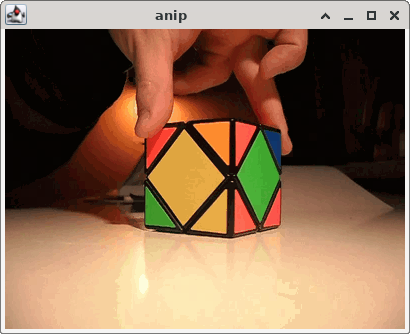

# anip

## Description

Java-based video codec for cel animation.



`anip` (short for "animaation pakkaaja", i.e., "animation compressor" in
English) is a Java-based video codec for cel animation. I made it on 2008 as
an individual project work for an object-oriented programming course, when I
was an undergraduate student at Helsinki University of Technology (now
Aalto University).

## Features

- input as sequence of BMP files
- split a frame into 8x8 pixel block
- save cells if they change by a certain threshold compared to the same
  cell in the previous frame
- 8-bit palette per frame
- 4-bit subpalette per 16x16 pixel block
- run length encoding of 16x16 pixel blocks

The practical compression ratio for cel animation is from 1:10 to 1:30. Compare
to MPEG-2 on a DVD, which is around 1:40. However, the demo video `skewb.ap` is
a real-life video with still camera and background, a moving hand and a
geometrical object with flat shades, 400x300 pixels, 24 bits/pixel, 25 fps,
20 seconds, total 20 MB. This yields a compression ratio of

  400 * 300 * 24/8 * 25 * 20 / 20000000  ~= 9.3.

## Demo

Download the source code and a Java runtime, e.g.
[Oracle Java](https://www.java.com/en/) or
[OpenJDK](https://openjdk.org/index.html).

After the setup above, try:
```
java -jar anip.jar media/skewb.ap
```

That should play an animation where a hand rotates a
[Skewb puzzle cube](https://en.wikipedia.org/wiki/Skewb).

## Usage

```
anip c animation.ap N.n image0000.bmp 
	Creates a new animation file from a sequence of image files. N.n is the frame rate of the animation. 0000 indicates the number of leading zeros in the image file names.

anip x animation.ap image0000.bmp [A [B]]
	Extracts a sequence of images from an existing animation file. 0000 indicates the number of leading zeros in the image file names. If A or A and B are be specified, A is the number of the first frame to be extracted and B is the last one.

anip animation.ap
	Plays an animation file on a window.

```

## Source code

In the [src](src/) subdirectory.

## Documentation

- [Javadoc](doc/dokumentaatio/javadoc/all/index.html)
- [Final project documentation (Finnish)](doc/dokumentaatio/dokumentti.html)
- [Project plan (in Finnish)](doc/suunnitelma/)

